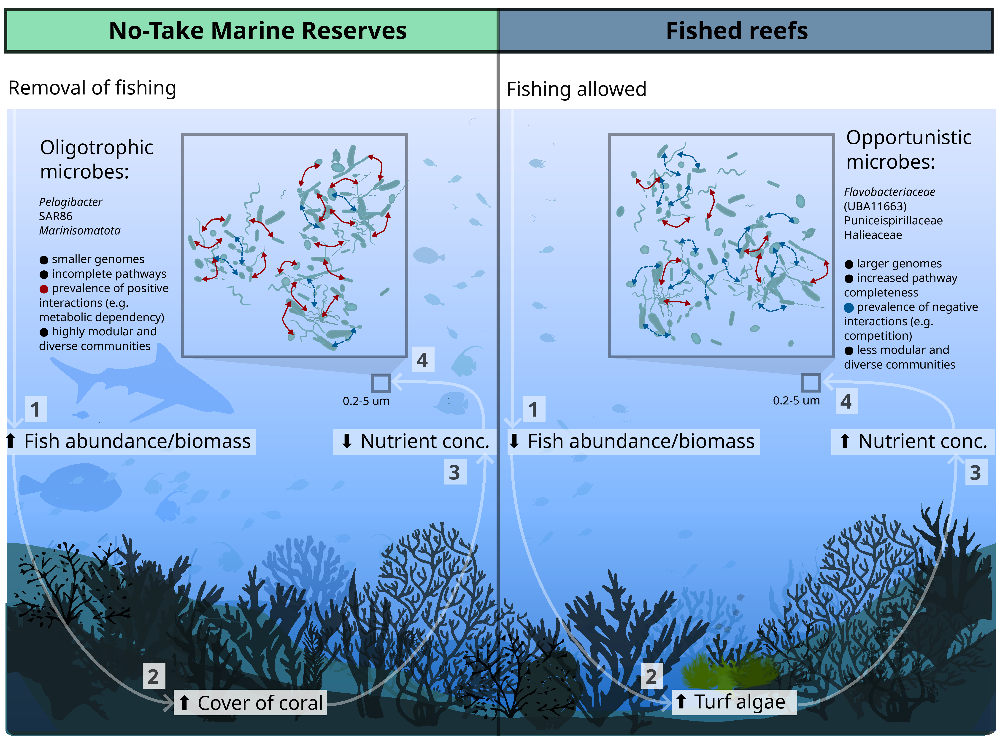

# No-take marine reserves promote oligotrophic reef bacterioplankton communities across the Great Barrier Reef

[](https://doi.org/10.5281/zenodo.17109887)
[](https://www.r-project.org/)
[](https://opensource.org/licenses/MIT)

**Authors:** Marko Terzin<sup>1,2,3,*</sup>, Steven J. Robbins<sup>4</sup>, Kim-Anh Lê Cao<sup>5</sup>, Sara C. Bell<sup>1</sup>, Katherine E. Dougan<sup>4</sup>, Julian Zaugg<sup>4</sup>, Renee K. Gruber<sup>1</sup>, Michael J. Emslie<sup>1</sup>, Daniela M. Ceccarelli<sup>1</sup>, Samuel Chaffron<sup>6,7</sup>, Philip Hugenholtz<sup>4</sup>, Nicole S. Webster<sup>1,4,8</sup>, David G. Bourne<sup>1,2,3</sup>, Yun Kit Yeoh<sup>1,3</sup>, Patrick W. Laffy<sup>1,3,*</sup>

<sup>1</sup>Australian Institute of Marine Science, PMB no3 Townsville MC, Townsville QLD 4810  
<sup>2</sup>College of Science and Engineering, James Cook University, Townsville, 4811  
<sup>3</sup>AIMS@JCU, James Cook University, Townsville QLD 4811  
<sup>4</sup>Australian Centre for Ecogenomics, School of Chemistry and Molecular Biosciences, The University of Queensland, St Lucia, QLD 4072  
<sup>5</sup>Melbourne Integrative Genomics and School of Mathematics and Statistics, University of Melbourne, Melbourne, Parkville VIC 3052  
<sup>6</sup>Nantes Université, École Centrale Nantes, CNRS, LS2N, UMR 6004, F-44000 Nantes, France  
<sup>7</sup>Research Federation for the Study of Global Ocean Systems Ecology and Evolution, FR2022/Tara Oceans GOSEE, F-75016 Paris, France  
<sup>8</sup>Institute for Marine and Antarctic Studies, University of Tasmania, TAS, 7001  
<sup>*</sup>Corresponding authors

**Status:** Under revision at *Nature Communications*

---

## Project Overview

This study investigates the relationship between seawater microbiomes, environmental variables, and reef protection status (No-Take Marine Reserves vs. fished reefs) across the Great Barrier Reef (GBR). We integrated 876 prokaryotic metagenome-assembled genomes (pMAGs), physico-chemical water data, benthic cover, and fish survey data to identify microbial indicators of reef zoning and predict environmental conditions from microbial community composition.

## Conceptual model

The conceptual framework proposed in this study linking reef protection status,
fish biomass, benthic cover, nutrient dynamics, and seawater microbial
community structure.

<p align="center">
  
</p>

🐟 Fish surveys      🪸 Benthic cover      🧪 Water chemistry
          \               |               /
           \              |              /
            → 🌊 Seawater metagenomes ←
                        |
               🧬 Nanopore + Illumina
                        |
                📦 5,283 recovered pMAGs
                        |
              🗄️ GBR Microbial Database
                        |
             🤖 Machine learning analyses
                        |
      🪸 Reef zoning & environmental prediction

**Key finding:** NTMRs harbor distinct seawater microbiomes characterized by oligotrophic taxa (*Pelagibacterales*, SAR86, *Marinismatales*), while fished reefs are enriched in copiotrophic taxa (*Flavobacteriales*, UA16). These microbial signatures predict zoning with ~71% accuracy across 7 GBR sectors.

---

## Data Availability

| Data type | Repository | Accession/Link |
|-----------|------------|----------------|
| Metagenomic Sequences | EBI BioProject | [PRJEB82623](https://www.ebi.ac.uk/ena/browser/view/PRJEB82623) |
| pMAGs (5,283 high-quality) | Zenodo | [10.5281/zenodo.17109887](https://doi.org/10.5281/zenodo.17109887) |
| Processed abundance tables | Zenodo | [10.5281/zenodo.17109887](https://doi.org/10.5281/zenodo.17109887) |
| Physico-chemical variables | IMOS-AODN | [10.25845/Q4XH-YN10](https://doi.org/10.25845/Q4XH-YN10) |
| Benthic cover & fish data | AIMS LTMP | [AIMS Data Portal](https://apps.aims.gov.au/metadata/view/a17249ab-5316-4396-bb27-29f2d568f727) |
| Assembly & binning code | *bioRxiv* | [Robbins et al. 2025](https://www.biorxiv.org/content/10.1101/2025.05.13.653689v1) |

## Metagenomic Processing

Metagenomes were assembled using the **Aviary v0.3.3** pipeline, which generated:
- **Hybrid assemblies** (Illumina + Nanopore) for 27 sites
- **Short-read-only assemblies** for 21 sites

### Assembly & Binning
- **Long-read processing**: Guppy v5.0.16 (superaccuracy basecalling), Porechop (adapter/barcode trimming)
- **Assembly**: Aviary v0.3.3 with metaFlye and metaSPAdes
- **Binning**: MetaBAT2, MaxBin2, CONCOCT, and VAMB
- **Refinement**: DAS Tool v1.1.2
- **Quality assessment**: CheckM v1.2.2 and CheckM2 v1.0.2

### Dereplication & Abundance
- **Dereplication**: CoverM v0.6 at 95% Average Nucleotide Identity (ANI)
- **Result**: 5,283 pMAGs → 876 "species-resolved" pMAGs<sub>95%ANI</sub>
- **Read mapping**: minimap2 v2.18 (via CoverM) for abundance estimation

### Taxonomic & Functional Annotation
- **Taxonomy**: Genome Taxonomy Database Toolkit (GTDB-Tk, release R214)
- **Functional annotation**: anvi'o v8 with KEGG Orthology (KO) database
- **Metabolic pathways**: KEGG module completeness (358 modules detected)

---

## Analysis Workflow

### Figure 1: Study Site Map (`Figure_1.Rmd`)
- Map of 48 offshore reefs across 7 GBR sectors
- Sampling timeline: 4 transects (Nov 2019 – Jul 2020) and 7 sectors
- Reef protection status and GBR zoning categories

### Figure 2: Microbial Indicators of Reef Protection (`Figure_2_Nature_Communications.Rmd`)

This script implements a comprehensive analytical framework to identify and validate microbial indicators of reef protection status:

**1. Community-level assessment:**
- **PCA**: Principal Components Analysis to explore major sources of variation in microbial community composition (`mixOmics` v6.26.0)
- **PERMANOVA**: Permutational Multivariate Analysis of Variance testing the effect of reef protection status on microbial communities while accounting for sampling trip, geographic sector, and reef identity as spatiotemporal covariates (`vegan` v2.6-4; 9,999 permutations)
- **dbRDA**: Distance-based Redundancy Analysis for constrained ordination of protection effects

**2. Indicator identification with spatiotemporal integration:**
- **MINT sPLS-DA**: Multivariate INTegration Sparse Partial Least Squares Discriminant Analysis that identifies microbial indicators discriminating between NTMRs and fished reefs while accounting for sector-specific variation (`mixOmics` v6.26.0). Leave-One-Group-Out Cross-Validation (LOGOCV) with iterative training on six sectors and validation on the remaining sector was used to determine optimal number of MINT sPLS-DA components and features.
- **Permutation testing**: Zone-label shuffling (999 permutations within sectors) to generate null distribution and calculate p-value and Cohen's d effect size.

**3. Independent validation methods:**
- **Random Forest classification**: Non-linear supervised learning with leave-one-sector-out cross-validation, permutation testing (999 iterations), feature importance assessment, and methodological concordance analysis (Jaccard similarity, Cohen's Kappa) (`randomForest` v4.7-1.1)
- **ALDEx2 pairwise comparison**: Welch's t-test and Wilcoxon rank-sum tests on CLR-transformed abundances without covariates
- **ALDEx2 GLM**: ANOVA-like differential expression with Generalized Linear Models incorporating spatiotemporal covariates (Open_or_Closed_to_fishing + Sampling_trip + SECTOR_N_S) using Dirichlet-multinomial modeling (128 Monte Carlo samples, FDR correction α = 0.05) (`ALDEx2` v1.34.0)

**4. Validation of indicator robustness:**
- **Presence/absence analysis**: Detection frequency quantification for indicator MAGs across 190 samples using raw count data to assess whether abundance differences reflect genuine ecological variation versus genome size bias
- **Read-based validation**: Assembly-independent verification using DIAMOND (v2.0.9) mapping against NCBI nr database, MEGAN (v6.23.0) taxonomic profiling, and MINT sPLS-DA on read-based profiles to confirm indicator selection across independent methods

### Figure 3: Microbial-Environment Correlations (`Figure_3.Rmd`)
- **MINT sPLS**: Integrating 876 MAGs with 54 environmental variables
- Biplots and clustered image maps (CIM)

### Figure 4: Microbial Network Analysis (`Figure_4.Rmd`)
- **Co-occurrence networks**: Connectedness and cohesion metrics (Herren & McMahon 2017)
- **Network comparison**: NTMR vs. fished reef networks (connectedness and cohesion)
- **Regression**: Genome size, GC content, and KEGG module completeness vs. network properties

A custom-made Python script implements co-occurrence network analysis to compare microbial community structure (**MODULARITY**) between NTMR and fished reefs:

**1. Network construction (FlashWeave):**
- **Co-occurrence networks**: Constructed for each sector × zone combination (n = 14 networks) using FlashWeave<sup>86</sup> (v0.19.2) via the `flashweave` Julia package
- **Data transformation**: Raw count tables were CLR-transformed with pseudocounts added (1e-6)
- **Network parameters**: Sensitive mode (α = 0.01, max_k = 2) with a minimum of 4 samples per network
- **Edge filtering**: Only positive partial correlations (weight > 0) were retained, consistent with the predominance of positive associations in global plankton interactomes (98.5% positive edges; Chaffron et al., 2021)<sup>83</sup>

**2. Modularity analysis:**
- **Binary network conversion**: Positive correlation networks were converted to binary (unweighted) graphs by retaining edges with weight > 0
- **Modularity calculation**: Computed using the Clauset-Newman-Moore greedy algorithm<sup>87</sup> as implemented in the `cluster_fast_greedy` function from `igraph` v1.5.1<sup>88</sup>
- **Community detection**: Modularity measures the degree of network compartmentalization, where higher values indicate more compartmentalised community structure

**3. Statistical comparison:**
- **Between-zone comparison**: Mann-Whitney U tests comparing modularity values between NTMR (n = 7) and fished (n = 7) sector-specific networks
- **Effect size**: Cohen's d calculated to quantify magnitude of differences

**4. Visualization:**
- Boxplots comparing modularity distributions between protection statuses with sector-specific shapes and trip colors

### Figure 5: Differential Metabolic Potential of Indicator pMAGs (`Figure_5.Rmd`)
- **KEGG module completeness**: Comparing completeness scores of 358 KEGG modules between fished reef-enriched and NTMR-enriched indicator pMAGs
- **Top 45 modules**: Heatmap of modules with greatest between-group differences, grouped by metabolic category (carbohydrate metabolism, energy generation, biosynthesis of cofactors, vitamins, amino acids, and lipids)
- **Statistical testing**: Wilcoxon rank-sum tests comparing mean 

### Figure 6: Environmental Predictions & Microbial Niche Analysis (`Figure_6.Rmd`)

**1. Random Forest environmental prediction:**
- **Model performance**: RF models predicting continuous environmental variables, evaluated across 50 stratified permutation tests per variable (80/20 train/test split stratified by GBR sector)
- **High accuracy predictions** (R² > 0.6): seawater temperature (R² = 0.74), salinity, particulate nutrients (POC R² = 0.74, PN R² = 0.66), and dissolved inorganic phosphorus (PO₄³⁻ R² = 0.69, TDP R² = 0.79)
- **Low-to-moderate accuracy** (R² < 0.6): dissolved nitrogen species, silicate, benthic cover variables, and most fish groups (exception: corallivore fish biomass, median R² = 0.72)

**2. Microbial niche inference:**
- **Niche modeling**: Robust optimum (RO) method (Chaffron et al. 2021) applied to top 50 RF predictors per environmental variable
- **Niche bounds**: Q1 (lower bound), Q2 (optimum), Q3 (upper bound)
- **Specialist vs. generalist taxa**: Narrow niche ranges associated with high RF prediction accuracy; broad niches associated with weaker predictive power
- **Example**: Top 50 temperature predictors show narrow thermal niche (Q1–Q3: 27.38 ± 2.11°C to 28.38 ± 1.73°C; optimum Q2: 27.84 ± 1.88°C), predominantly *Flavobacteriales* (46%)

---

## Key R Packages and Versions

| Package | Version | Citation | Purpose |
|---------|---------|----------|---------|
| mixOmics | 6.26.0 | Rohart et al. 2017 | MINT sPLS-DA, MINT sPLS |
| vegan | 2.6-4 | Oksanen et al. 2022 | PERMANOVA, dbRDA |
| randomForest | 4.7-1.1 | Liaw & Wiener 2002 | Random Forest classification/regression |
| ALDEx2 | 1.32.0 | Fernandes et al. 2013 | Differential abundance testing |
| glmmTMB | 1.1.10 | Brooks et al. 2017 | GLMMs for environmental variables |
| DHARMa | 0.4.7 | Hartig 2022 | GLMM residual diagnostics |
| phyloseq | 1.46.0 | McMurdie & Holmes 2013 | Microbiome data handling |
| microbiome | 1.24.0 | Lahti & Shetty 2017 | CLR transformation |
| igraph | 1.5.1 | Csárdi & Nepusz 2006 | Network analysis, modularity |
| tidyverse | 2.0.0 | Wickham et al. 2019 | Data wrangling & visualization |
| ggplot2 | 3.5.1 | Wickham 2016 | Publication-quality graphics |
| patchwork | 1.2.0 | Pedersen 2024 | Plot composition |
| dataaimsr | 1.0.0 | Australian Institute of Marine Science | Spatial data access |
| gisaimsr | 1.0.0 | Australian Institute of Marine Science | Spatial data access |

## External Software & Tools

| Software | Version | Citation | Purpose |
|----------|---------|----------|---------|
| FlashWeave | 0.19.2 | Tackmann et al. 2019 | Co-occurrence network inference |
| Python | 3.12 | Python Core Team | Modularity analysis scripting |
| networkx | 3.6.1 | Hagberg et al. 2008 | Python network analysis (alternative) |
| scipy | 1.12.0 | Virtanen et al. 2020 | Statistical tests in Python |
| anvi'o | 8 | Eren et al. 2015 | Functional annotation |
| CoverM | 0.6 | Aroney et al. 2025 | MAG dereplication |
| Aviary | 0.3.3 | Robbins et al. 2025 | Metagenomic assembly & binning |
| DIAMOND | 2.0.9 | Buchfink et al. 2015 | Read-based validation |
| MEGAN | 6.23.0 | Huson et al. 2016 | Taxonomic profiling |

Full session details available in `sessionInfo.txt`.

## Python Environment for Modularity Analysis

The modularity analysis requires a Python environment with the following dependencies:

```bash
# Create conda environment (optional)
conda create -n modularity_env python=3.12
conda activate modularity_env

# Install required packages
pip install networkx pandas numpy scipy matplotlib

---

## Usage

### 1. Clone the repository

```bash
git clone https://github.com/mterzin/fishy_microbes.git
cd fishy_microbes

